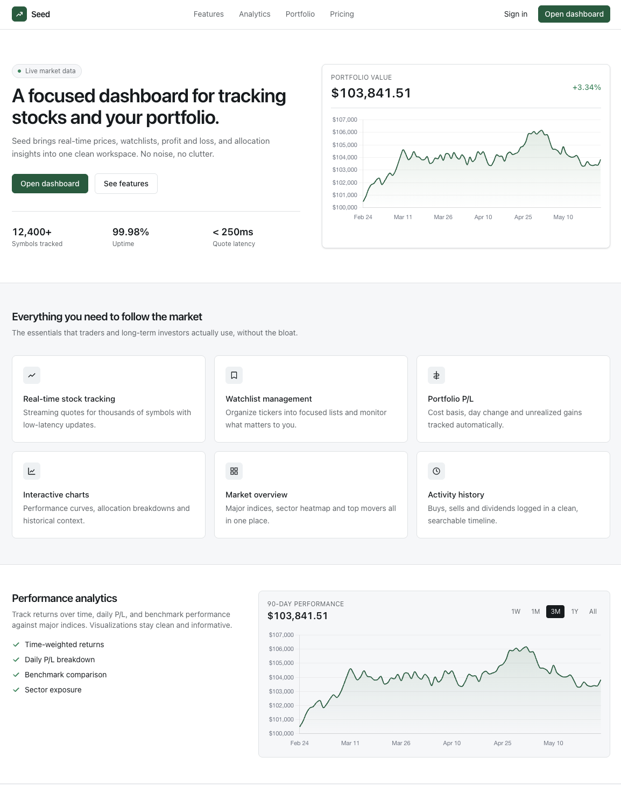
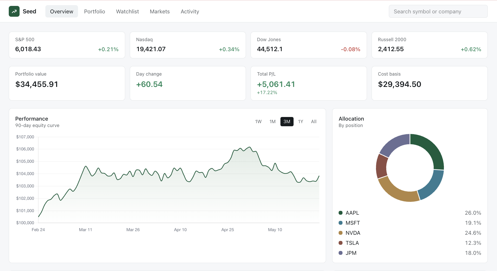
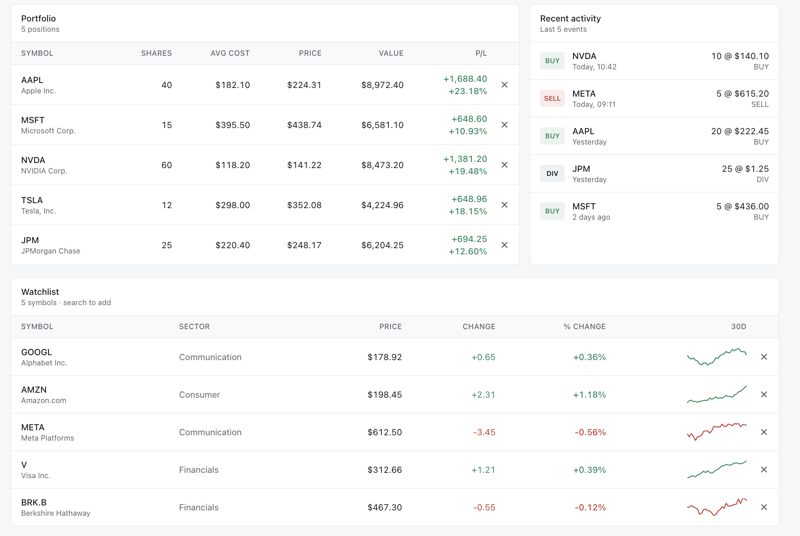

<div align="center">


<br/>


<br/>


</div>

---

# Market Overview

SEED is a modern trading simulation and portfolio analytics platform designed to provide a realistic financial dashboard experience.

It combines:

- Real-time market monitoring
- Portfolio management
- Profit/Loss tracking
- Watchlist management
- Interactive charts
- Portfolio insights
- Performance analytics

---

# Dashboard Preview

## Landing Page



---

## Portfolio Dashboard



---

## Analytics



---

# Features

### Market Intelligence

- Live stock monitoring
- Market overview
- Trending stocks
- Watchlist tracking

### Portfolio Analytics

- Portfolio allocation
- Profit/Loss tracking
- Growth metrics
- Performance insights

### Visualization

- Interactive charts
- Portfolio performance graphs
- Allocation donut charts
- Historical trend analysis

---

# Tech Stack

| Category | Technology |
|----------|------------|
| Frontend | React + TypeScript |
| Styling | Tailwind CSS |
| Charts | Chart.js |
| Build Tool | Vite |
| Storage | LocalStorage |

---

# Project Setup

```bash
git clone https://github.com/Naman-iitm/Seed-Smart-Trading-Portfolio-Tracking-Platform-.git

cd Seed-Smart-Trading-Portfolio-Tracking-Platform-

npm install

npm run dev
```

---

<div align="center">

Built with a focus on modern financial UI and practical investment analytics.

</div>
