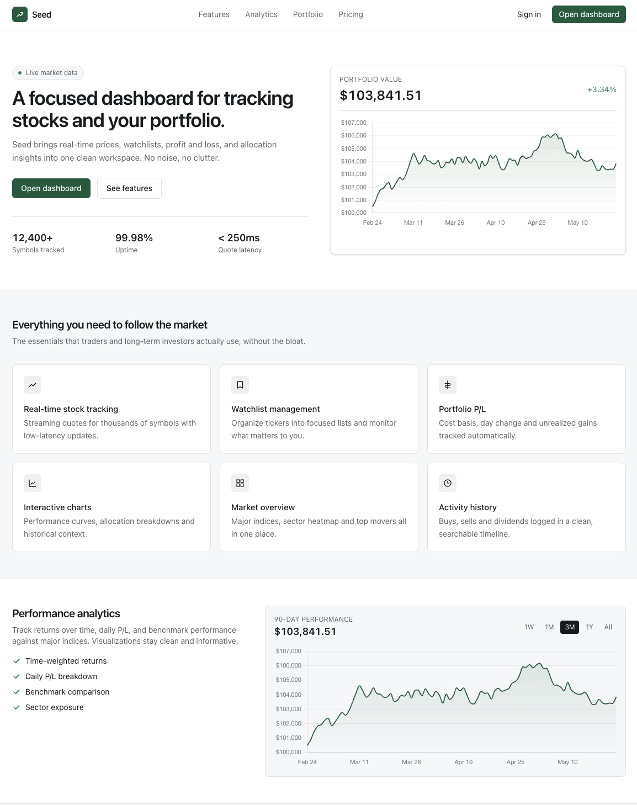
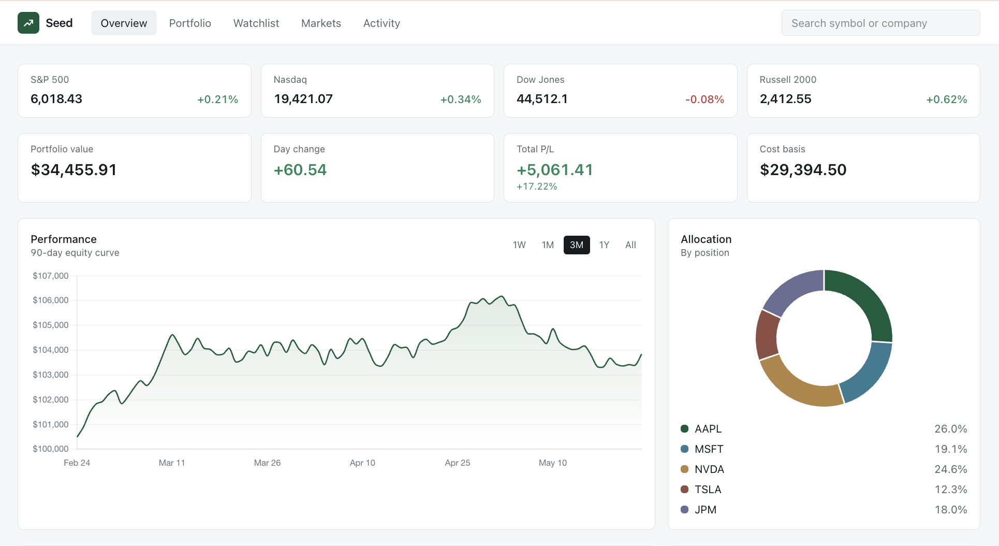
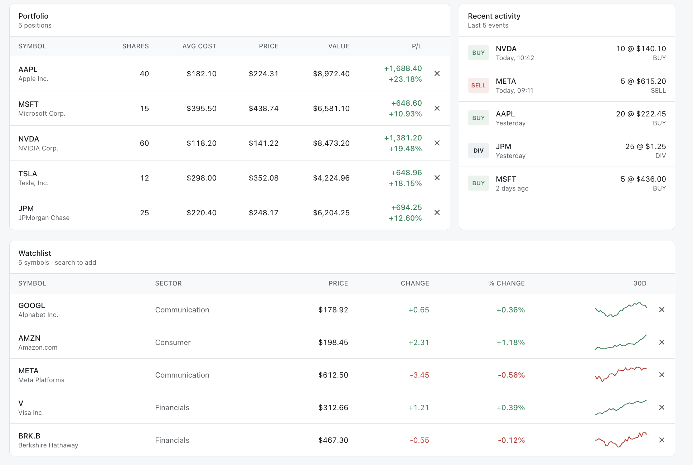

<div align="center">


<br/>


<br/>


</div>

---

# Market Overview

SEED is a modern trading simulation and portfolio analytics platform designed to provide a realistic financial dashboard experience.

It combines:

- Real-time market monitoring
- Portfolio management
- Profit/Loss tracking
- Watchlist management
- Interactive charts
- Portfolio insights
- Performance analytics

---

# Dashboard Preview

## Landing Page



---

## Portfolio Dashboard



---

## Analytics



---

# Features

### Market Intelligence

- Live stock monitoring
- Market overview
- Trending stocks
- Watchlist tracking

### Portfolio Analytics

- Portfolio allocation
- Profit/Loss tracking
- Growth metrics
- Performance insights

### Visualization

- Interactive charts
- Portfolio performance graphs
- Allocation donut charts
- Historical trend analysis

---

# Tech Stack

| Category   | Technology         |
| ---------- | ------------------ |
| Frontend   | React + TypeScript |
| Styling    | Tailwind CSS       |
| Charts     | Chart.js           |
| Build Tool | Vite               |
| Storage    | LocalStorage       |

---

# Project Setup

```bash
git clone https://github.com/Naman-iitm/Seed-Smart-Trading-Portfolio-Tracking-Platform-.git

cd Seed-Smart-Trading-Portfolio-Tracking-Platform-

npm install

npm run dev
```

---

<div align="center">

### Built for modern portfolio tracking and investment analytics

**Naman Jha**
**Founding - OBLIQ.io | IIT Madras | University of Cambridge JBS | NIT Trichy**

**Linkedin** : [https://www.linkedin.com/in/naman-iitm/]

</div>


---

## 🚀 Getting Started

Follow these instructions to get a copy of the project up and running on your local machine for development and testing purposes.

### Prerequisites

This project can be managed using either **npm** or **Bun**. Ensure you have Node.js or Bun installed on your system.

* **Node.js**: `v18+` recommended
* **Bun**: `v1.0+` recommended

### 💻 Installation & Local Development

1. **Clone the repository:**
   ```bash
   git clone [https://github.com/Vaanshimadaan/AgroDex.git](https://github.com/Vaanshimadaan/AgroDex.git)
   cd AgroDex

   ├── backend/               # Backend application logic and APIs
├── e2e/                   # End-to-end testing configurations (Playwright)
├── public/                # Static assets like images, icons, and fonts
├── src/                   # Main frontend application source code
│   ├── assets/            # Project-specific local assets (styles, global images)
│   ├── components/        # Reusable UI components (including shadcn/ui components)
│   ├── context(s)/        # React Context providers for global state management
│   ├── hooks/             # Custom React hooks
│   └── pages/             # Page components mapping to application routes
├── bunfig.toml            # Configuration file for Bun package manager
├── components.json        # Shadcn UI configuration file
└── eslint.config.js       # ESLint configurations for code quality and linting
